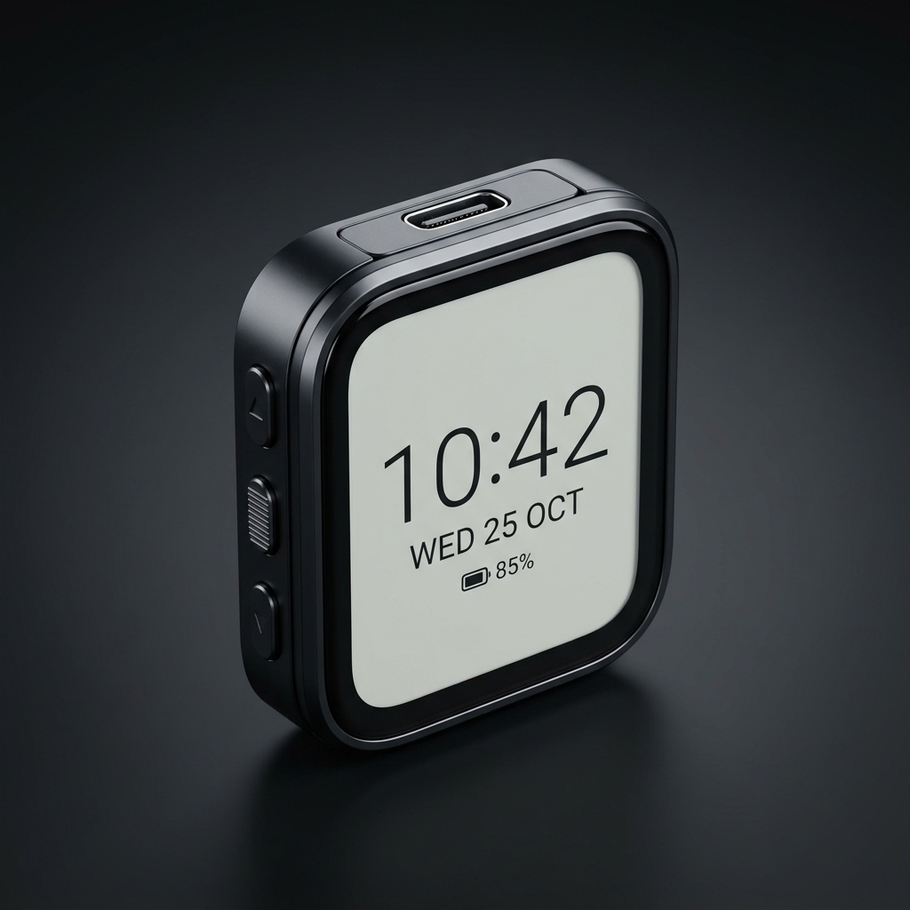
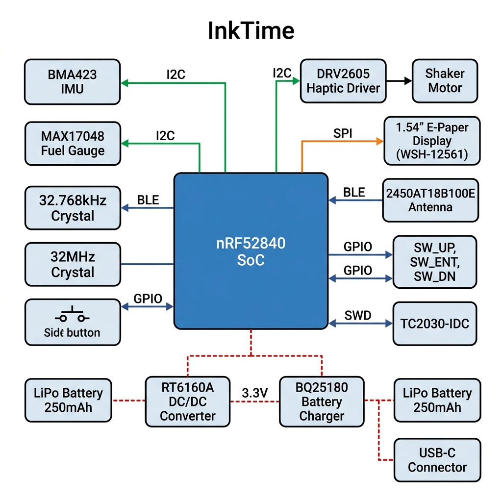
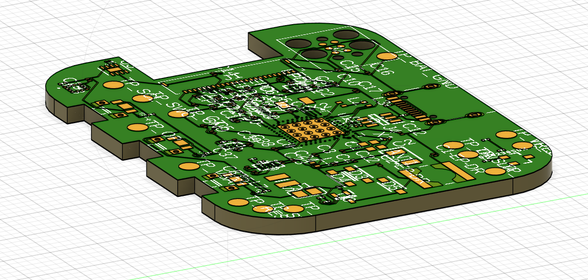
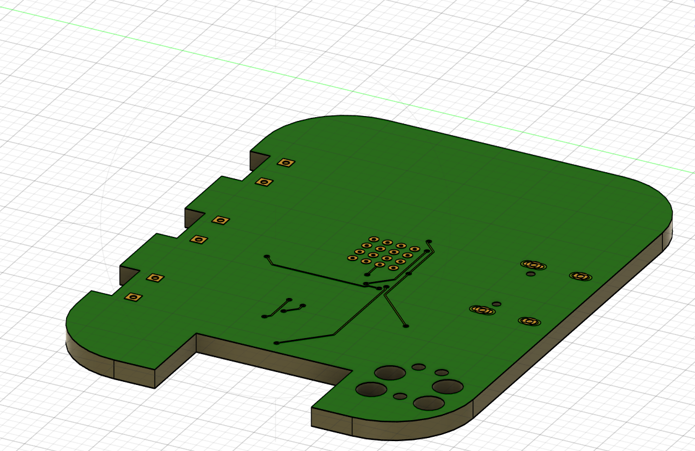
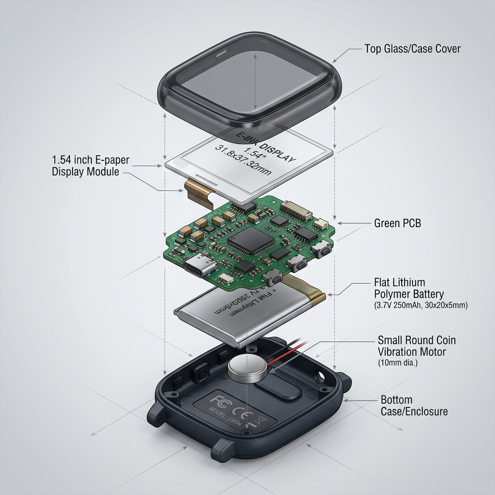

# InkTime ⌚ — Smartwatch Open Source

<p align="center">
  
</p>

**InkTime** este un smartwatch open-source, cu cost redus, construit în jurul **Nordic nRF52840** System-on-Chip, echipat cu un **display e-paper de 1.54"**. Proiectat pentru producție de masă, acest proiect acoperă designul hardware complet, de la schemă până la fișierele necesare fabricației.

---

## 📋 Cuprins
- [Diagrama Bloc](#diagrama-bloc)
- [Bill of Materials (BOM)](#bill-of-materials-bom)
- [Funcționalitatea Hardware](#funcționalitatea-hardware)
- [Maparea Pinilor nRF52840](#maparea-pinilor-nrf52840)
- [Analiza Consumului de Energie](#analiza-consumului-de-energie)
- [Designul PCB](#designul-pcb)
- [Design Mecanic](#design-mecanic)
- [Decizii de Design și Observații](#decizii-de-design-și-observații)
- [Structura Repository-ului](#structura-repository-ului)
- [Licență](#licență)

---

## Diagrama Bloc

<p align="center">
  
</p>

### Arhitectura Sistemului

```
                            ┌─────────────────────────────────────────────────┐
                            │              nRF52840 SoC (QFN48)              │
                            │                                                 │
                            │  ARM Cortex-M4F @ 64MHz                        │
                            │  1MB Flash / 256KB RAM                          │
                            │  Bluetooth 5.0 / BLE                            │
                            │  USB 2.0 Full Speed                             │
                            │                                                 │
  ┌──────────────┐   SPI    │  P0.02 (SCK)  ──┐                              │
  │  1.54" E-Ink │◄────────►│  P0.03 (MOSI) ──┤ SPI                          │
  │   Display    │          │  P0.28 (MISO) ──┤                              │
  │  (WSH-12561) │          │  P0.29 (CS)   ──┘                              │
  │  200x200 px  │          │  P0.04 (DC)                                     │
  │              │          │  P0.05 (RST)                                    │
  │              │          │  P0.06 (BUSY)                                   │
  └──────────────┘          │                                                 │
                            │                    ┌─────────────────────┐      │
  ┌──────────────┐   I2C    │  P0.26 (SDA) ─────►│ Magistrala I2C      │      │
  │  BMA423 IMU  │◄────────►│  P0.27 (SCL) ─────►│                     │      │
  │ Accelerometru│          │                    │  ├─ BMA423 (0x18)   │      │
  └──────────────┘          │                    │  ├─ MAX17048 (0x36) │      │
                            │                    │  └─ DRV2605 (0x5A)  │      │
  ┌──────────────┐   I2C    │                    └─────────────────────┘      │
  │  MAX17048    │◄─────────│                                                 │
  │ Fuel Gauge   │          │                                                 │
  └──────────────┘          │                                                 │
                            │                                                 │
  ┌──────────────┐   I2C    │                                                 │
  │  DRV2605     │◄─────────│                                                 │
  │ Driver Haptic│          │                                                 │
  │      │       │          │                                                 │
  │  ┌───▼────┐  │          │                                                 │
  │  │ Shaker │  │          │                                                 │
  │  │FIT0774 │  │          │                                                 │
  │  └────────┘  │          │                                                 │
  └──────────────┘          │                                                 │
                            │  P0.13 ──── SW_UP   (Buton)                     │
  ┌──────────────┐   GPIO   │  P0.14 ──── SW_ENT  (Buton)                     │
  │  3 Butoane   │◄────────►│  P0.15 ──── SW_DN   (Buton)                     │
  └──────────────┘          │                                                 │
                            │  P0.18 (D-) ──┐                                 │
  ┌──────────────┐   USB    │  P0.20 (D+) ──┤ USB 2.0 FS                     │
  │   USB-C      │◄────────►│               ──┘                              │
  │  Conector    │          │                                                 │
  │ (KH-TYPE-C)  │          │                                                 │
  └──────────────┘          │  SWDIO ──┐                                      │
                            │  SWDCLK ─┤ SWD Debug                           │
  ┌──────────────┐   SWD    │  SWO ────┘                                      │
  │   TC2030     │◄────────►│                                                 │
  │ Header Debug │          │                                                 │
  └──────────────┘          │  XC1/XC2 ─── Cristal 32 MHz                     │
                            │  P0.00/P0.01 ─── Cristal 32.768 kHz             │
  ┌──────────────┐          │                                                 │
  │  2450AT18B   │◄─────────│  ANT ──── Ieșire RF (2.4 GHz BLE)              │
  │ Antenă Chip  │          │                                                 │
  └──────────────┘          └─────────────────────────────────────────────────┘

  ┌─────────────────────────────────────────────────────────────────┐
  │                  SUBSISTEMUL DE ALIMENTARE                       │
  │                                                                 │
  │  ┌────────┐    ┌───────────┐    ┌───────────┐    ┌───────────┐ │
  │  │ USB-C  │───►│ BQ25180   │───►│ Baterie   │    │ RT6160A   │ │
  │  │  5V    │    │ Încărcător│    │ LiPo      │───►│ DC/DC     │ │
  │  │        │    │           │    │ 250mAh    │    │ Buck      │ │
  │  └────────┘    └───────────┘    │ 3.7V      │    │ 3.3V Ieș  │ │
  │                                 └───────────┘    └─────┬─────┘ │
  │  ┌────────────┐                                         │       │
  │  │ DMG2305UX  │◄── Comutator Sarcină (PMOS) ────────────┘       │
  │  │ P-MOSFET   │                                                 │
  │  └────────────┘         Linie 3.3V ──► Toate IC-urile           │
  └─────────────────────────────────────────────────────────────────┘
```

---

## Bill of Materials (BOM)

### Circuite Integrate și Module Principale

| # | Referință | Componentă | Valoare / Cod | Capsulă | Cant. | JLC Parts | Datasheet |
|---|-----------|-----------|---------------------|---------|-----|-----------|-----------| 
| 1 | U1 | Microcontroler | nRF52840-QIAA | aQFN73 (7x7mm) | 1 | [C190794](https://jlcpcb.com/parts/componentSearch?isSearch=true&searchTxt=nRF52840) | [Datasheet](https://infocenter.nordicsemi.com/pdf/nRF52840_PS_v1.8.pdf) |
| 2 | IC2 | Încărcător Baterie | BQ25180YBGR | DSBGA-8 | 1 | [C2682092](https://jlcpcb.com/parts/componentSearch?isSearch=true&searchTxt=BQ25180) | [Datasheet](https://www.ti.com/lit/ds/symlink/bq25180.pdf) |
| 3 | IC9 | Convertor DC/DC | RT6160AWSC | WLCSP-15 | 1 | [C2828036](https://jlcpcb.com/parts/componentSearch?isSearch=true&searchTxt=RT6160A) | [Datasheet](https://www.richtek.com/assets/product_file/RT6160A/DS6160A-05.pdf) |
| 4 | U3 | Indicator Baterie | MAX17048G+T10 | DFN 2x2-8 | 1 | [C2682766](https://jlcpcb.com/parts/componentSearch?isSearch=true&searchTxt=MAX17048) | [Datasheet](https://datasheets.maximintegrated.com/en/ds/MAX17048-MAX17049.pdf) |
| 5 | IC3 | IMU / Accelerometru | BMA423 | LGA-12 | 1 | [C2831316](https://jlcpcb.com/parts/componentSearch?isSearch=true&searchTxt=BMA423) | [Datasheet](https://www.bosch-sensortec.com/products/motion-sensors/accelerometers/bma423/) |
| 6 | IC1 | Driver Haptic | DRV2605YZFR | BGA-9 | 1 | [C527680](https://jlcpcb.com/parts/componentSearch?isSearch=true&searchTxt=DRV2605) | [Datasheet](https://www.ti.com/lit/ds/symlink/drv2605.pdf) |
| 7 | D1 | Protecție ESD USB | USBLC6-2SC6Y | SOT-23-6 | 1 | [C7519](https://jlcpcb.com/parts/componentSearch?isSearch=true&searchTxt=USBLC6-2SC6Y) | [Datasheet](https://www.st.com/resource/en/datasheet/usblc6-2.pdf) |
| 8 | DMG2305UX | Comutator PMOS | DMG2305UX-7 | SOT-23-3 | 1 | [C150812](https://jlcpcb.com/parts/componentSearch?isSearch=true&searchTxt=DMG2305UX) | [Datasheet](https://www.diodes.com/assets/Datasheets/DMG2305UX.pdf) |
| 9 | Q3 | MOSFET (Driver motor) | SI1308EDL-T1-GE3 | SC-70-3 | 1 | [C515086](https://jlcpcb.com/parts/componentSearch?isSearch=true&searchTxt=SI1308EDL) | [Datasheet](https://www.vishay.com/docs/68743/si1308edl.pdf) |

### Conectori

| # | Referință | Componentă | Cod Componentă | Capsulă | Cant. | JLC Parts |
|---|-----------|-----------|-------------|---------|-----|-----------|
| 10 | J1 | Conector FPC pentru EPD | 503480-2400 (24-pin, 0.5mm) | SMD | 1 | [C585393](https://jlcpcb.com/parts/componentSearch?isSearch=true&searchTxt=503480-2400) |
| 11 | J2 | Header de Debug | TC2030-IDC | Through-hole | 1 | [C5191042](https://jlcpcb.com/parts/componentSearch?isSearch=true&searchTxt=TC2030) |
| 12 | J4 | Conector USB-C | KH-TYPE-C-16P | SMD | 1 | [C2765186](https://jlcpcb.com/parts/componentSearch?isSearch=true&searchTxt=KH-TYPE-C-16P) |

### Componente Pasive

| # | Referință | Componentă | Valoare | Capsulă | Cant. |
|---|-----------|-----------|-------|---------|-----|
| 13 | C1, C2, C17, C18 | Condensator | 12pF | 0201 | 4 |
| 14 | C3, C4 | Condensator | 1pF | 0201 | 2 |
| 15 | C5, C7, C8, C12, C19 | Condensator | 100nF | 0201 | 5 |
| 16 | C6, C14, C20, C21 | Condensator | 4.7µF | 0201 | 4 |
| 17 | C9 | Condensator | 820pF | 0201 | 1 |
| 18 | C11 | Condensator | 100pF | 0201 | 1 |
| 19 | C16 | Condensator | 27nF | 0201 | 1 |
| 20 | C1-EP-DR | Condensator | 10µF | 0201 | 1 |
| 21 | C2-EP-DR | Condensator | 4.7µF/25V | 0201 | 1 |
| 22 | C23, C34 | Condensator | 0.1µF | 0201 | 2 |
| 23 | C24 | Condensator | 10µF | 0201 | 1 |
| 24 | C25, C33 | Condensator | 22µF | 0201 | 2 |
| 25 | C32 | Condensator | 1µF | 0201 | 1 |
| 26 | C43 | Condensator | 4.7µF | 0201 | 1 |
| 27 | C27, C29, C30, C31, C42 | Condensator | GRM011R60J152KE01 (1.5nF) | 0201 | 5 |
| 28 | EPD_C1, EPD_C2 | Condensator | 1µF/50V | 0201 | 2 |
| 29 | EPD_C5–C12 | Condensator | 0.1µF/50V | 0201 | 8 |
| 30 | L1 | Bobină | 3.9nH | 0402 | 1 |
| 31 | L2 | Bobină | 10µH | 0402 | 1 |
| 32 | L3 | Bobină | 15nH | 0402 | 1 |
| 33 | L5 | Bobină | 68µH | 4828 | 1 |
| 34 | L7 | Bobină | 0.47µH | 2016 | 1 |
| 35 | R17, R18, R1_EP_DR–R9, R_PWR_EPD, R_TYPE_SEL | Rezistoare | Diverse | 0201 | 14 |
| 36 | D3, D4, D5 | Diodă Schottky | MBR0530 | SOD-323 | 3 |
| 37 | ANT1 | Antenă Chip | 2450AT18B100E | 3216 | 1 |
| 38 | X1 | Cristal | 32 MHz | 2016 | 1 |
| 39 | X2 | Cristal | 32.768 kHz | 3215 | 1 |
| 40 | SW_UP, SW_ENT, SW_DN | Buton Tactil | EVP-AKE31A | SMD | 3 |
| 41 | SJ1 | Jumper de Lipit | – | SMD | 1 |
| 42 | TP_* | Pad-uri de Test | – | TP20R | 14 |

### Componente Externe (nu sunt pe PCB)

| # | Componentă | Cod | Specificații | Link |
|---|-----------|-------------|----------------|------|
| 43 | Baterie LiPo | Akyga AKY0106 (LP502030) | 3.7V, 250mAh, 30×20×5mm | [TME](https://www.tme.eu/Document/b9e12bf26ad0ba929a22ab5d58f022cd/AKY0106.pdf) |
| 44 | Display E-Paper | Waveshare WSH-12561 (1.54") | 200×200px, 31.8×37.32×1.05mm | [TME](https://www.tme.eu/Document/0ca57a8ffbcd57b5bca53252eb9d6ec3/WSH-12561.pdf) |
| 45 | Motor de Vibrație | DFRobot FIT0774 | Ø10×2.7mm, 3V/50mA | [DFRobot](https://www.tme.eu/ro/details/df-fit0774/motoare-dc/dfrobot/fit0774/) |

---

## Funcționalitatea Hardware

### 1. Procesor și Conectivitate — nRF52840 (U1)

**Nordic nRF52840** este SoC-ul principal, oferind:
- **ARM Cortex-M4F** la **64 MHz** cu FPU (unitate de calcul în virgulă mobilă)
- **1 MB Flash** și **256 KB RAM**
- **Bluetooth 5.0 / BLE** prin radio integrat la 2.4 GHz
- **USB 2.0 Full-Speed** pentru transfer de date și negociere de încărcare
- **Convertor DC/DC integrat** pentru management eficient al puterii
- **ARM TrustZone CryptoCell-310** pentru securitate

nRF52840 este în capsulă **QFN73 (7×7mm)** cu matrice de pad-uri de tip BGA, suficient de compact pentru aplicații wearable.

**Surse de ceas:**
- **X1**: Cristal de 32 MHz — ceasul principal de sistem pentru radio și CPU
- **X2**: Cristal de 32.768 kHz — RTC de consum redus și timer de sleep

### 2. Display E-Paper — WSH-12561 (prin J1)

**Display-ul Waveshare e-paper de 1.54"** oferă:
- Rezoluție de **200×200 pixeli**
- **Consum ultra-redus** — consumă energie doar la reîmprospătare (refresh)
- **Interfață SPI** pentru comunicare rapidă
- Conectat prin conector **FPC cu 24 de pini, pas 0.5mm** (J1: Molex 503480-2400)

Circuitul driver EPD al display-ului necesită mai multe tensiuni de alimentare, generate prin pompele de sarcină (charge pumps) cu condensatoarele EPD_C1–C12.

**Semnale de interfață:**
| Semnal | Pin nRF52840 | Descriere |
|--------|-------------|-------------|
| SCLK | P0.02 | Ceas SPI |
| MOSI | P0.03 | Date SPI spre display |
| MISO | P0.28 | Date SPI de la display |
| CS | P0.29 | Chip Select (activ pe low) |
| DC | P0.04 | Selectare Date/Comandă |
| RST | P0.05 | Reset display (activ pe low) |
| BUSY | P0.06 | Indicator display ocupat |

### 3. Unitate de Măsură Inerțială — BMA423 (IC3)

**Bosch BMA423** este un accelerometru digital pe 3 axe, oferind:
- Numărare pași, recunoaștere activitate, detecție gesturi
- **Interfață I2C** (adresă: 0x18)
- Consum ultra-redus (~14 µA în modul low-power)
- Ideal pentru detecția ridicării încheieturii (wake on raise)

Conectat prin magistrala I2C comună (SDA: P0.26, SCL: P0.27).

### 4. Managementul Bateriei — BQ25180 (IC2) + MAX17048 (U3)

**Încărcător Baterie BQ25180 (IC2):**
- **Încărcător liniar** optimizat pentru dispozitive wearable
- Intrare de la USB-C (VBUS, 5V)
- Curent de încărcare programabil
- Parametri de încărcare **configurabili prin I2C**
- Capsulă compactă **DSBGA-8** (1.0×1.55mm)

**Indicator Baterie MAX17048 (U3):**
- Algoritm **ModelGauge™** — nu necesită rezistor de sens
- Raportează **starea de încărcare (SOC %)** și tensiunea
- **Interfață I2C** (adresă: 0x36)
- Curent de repaus ultra-redus (~23 µA)
- Capsulă **DFN 2×2mm**

**Traseul de alimentare:**
USB-C 5V → BQ25180 → Baterie LiPo (3.7V) → RT6160A → Linie de 3.3V pentru sistem

### 5. Regulare de Tensiune — RT6160A (IC9)

**Richtek RT6160A** este un convertor DC/DC de tip buck:
- Intrare: 2.5V – 5.5V (de la baterie sau USB)
- Ieșire: **3.3V** reglat
- Curent de ieșire de până la **2A**
- **Eficiență de 96%** la sarcină tipică
- Capsulă **WLCSP-15** (1.4×2.3mm)

Linia de 3.3V alimentează toate circuitele integrate, senzorii și display-ul.

**Componente suport:**
- **L7** (0.47µH) — bobina principală de comutare
- **C25, C33** (22µF) — condensatoare de ieșire
- **C23** (0.1µF), **C24** (10µF) — condensatoare de intrare

### 6. Feedback Haptic — DRV2605 (IC1) + FIT0774

**TI DRV2605** — driver pentru feedback haptic:
- Suport integrat pentru motoare **ERM și LRA**
- **Bibliotecă de 123 efecte haptice** (forme de undă)
- **Interfață I2C** (adresă: 0x5A)
- Conectat la motorul de vibrație **DFRobot FIT0774** (Ø10×2.7mm)
- Moduri de intrare PWM și analogic disponibile

### 7. Interfața USB-C — KH-TYPE-C-16P (J4)

- Conector **USB Type-C cu 16 pini**
- Suportă **USB 2.0 Full Speed** (D+/D- prin nRF52840)
- **Protecție ESD** prin USBLC6-2SC6Y (D1)
- **Rezistoarele pull-down CC** (R1_USB, R2_USB) pentru detectarea corectă USB-C
- Furnizează de asemenea **alimentare VBUS** către încărcătorul BQ25180

### 8. Interfața Utilizator — 3 Butoane

Trei butoane tactile **EVP-AKE31A** pentru navigare:
| Buton | Pin nRF52840 | Funcție |
|--------|-------------|----------|
| SW_UP | P0.13 | Derulare sus / Anterior |
| SW_ENT | P0.14 | Selectare / Enter |
| SW_DN | P0.15 | Derulare jos / Următor |

Amplasate pe marginea stângă a PCB-ului pentru operare ca butoane laterale. Fiecare buton este conectat cu pull-up intern și utilizează detecție de întrerupere pe front descrescător.

### 9. Interfața de Debug — TC2030-IDC (J2)

**Tag-Connect TC2030-IDC** oferă:
- Interfață **SWD (Serial Wire Debug)**
- Footprint cu **pini pogo fără picioare** (economisește spațiu pe PCB)
- Semnale: SWDIO, SWDCLK, SWO, VCC, GND, RESET

### 10. Antena BLE — 2450AT18B100E (ANT1)

- Antenă chip **Johanson 2450AT18B100E**
- **2.4 GHz** pentru Bluetooth Low Energy
- Footprint **3.2×1.6mm** (capsulă 3216)
- Rețea de adaptare: L1 (3.9nH), C3, C4 (1pF)
- **Amplasare critică**: la marginea plăcii, cu decupaj în planul de masă sub antenă

### 11. Protecție și Comutare de Putere

- **DMG2305UX-7** MOSFET canal P — comutator de sarcină pentru managementul puterii
- **MBR0530** diode Schottky (D3, D4, D5) — protecție la tensiune inversă pe liniile de alimentare
- **SI1308EDL** MOSFET canal N (Q3) — comutare motor/periferice

---

## Maparea Pinilor nRF52840

| Pin | GPIO | Funcție | Interfață | Direcție | Note |
|-----|------|----------|-----------|-----------|-------|
| P0.00 | XL1 | Cristal 32.768 kHz | LFCLK | I/O | Ceas de frecvență joasă |
| P0.01 | XL2 | Cristal 32.768 kHz | LFCLK | I/O | Ceas de frecvență joasă |
| P0.02 | AIN0 | Ceas SPI EPD | SPI SCK | Ieșire | Ceas display e-paper |
| P0.03 | AIN1 | SPI MOSI EPD | SPI MOSI | Ieșire | Date spre display |
| P0.04 | AIN2 | Date/Comandă EPD | GPIO | Ieșire | Selectare D/C |
| P0.05 | AIN3 | Reset EPD | GPIO | Ieșire | Reset activ pe low |
| P0.06 | AIN4 | Busy EPD | GPIO | Intrare | Indicator display ocupat |
| P0.13 | — | Buton SUS | GPIO | Intrare | Pull-up intern, IRQ |
| P0.14 | — | Buton ENTER | GPIO | Intrare | Pull-up intern, IRQ |
| P0.15 | — | Buton JOS | GPIO | Intrare | Pull-up intern, IRQ |
| P0.18 | — | USB D- | USB | I/O | Date USB 2.0 minus |
| P0.20 | — | USB D+ | USB | I/O | Date USB 2.0 plus |
| P0.26 | — | I2C SDA | TWI | I/O | Date I2C partajate |
| P0.27 | — | I2C SCL | TWI | Ieșire | Ceas I2C partajat |
| P0.28 | AIN4 | SPI MISO EPD | SPI MISO | Intrare | Date de la display |
| P0.29 | AIN5 | SPI CS EPD | SPI CS | Ieșire | Selectare chip, activ low |
| SWDIO | — | Date Debug | SWD | I/O | Programare/depanare |
| SWDCLK | — | Ceas Debug | SWD | Intrare | Programare/depanare |
| SWO | — | Trasare Debug | SWD | Ieșire | Ieșire de trasare |
| XC1 | — | Cristal 32 MHz | HFCLK | I/O | Ceas de frecvență înaltă |
| XC2 | — | Cristal 32 MHz | HFCLK | I/O | Ceas de frecvență înaltă |
| ANT | — | Antenă RF | Radio | Ieșire | Antenă BLE 2.4 GHz |
| VDD | — | Alimentare | PWR | Intrare | 3.3V de la RT6160A |
| VSS | — | Masă | PWR | — | Planul de masă |
| DEC1–DEC6 | — | Decuplare | PWR | — | Condensatoare 100nF necesare |

**Motivarea alegerii pinilor:**
- **P0.02–P0.06** au fost aleși pentru display-ul SPI deoarece suportă perifericul SPIM la viteză mare și sunt adiacenți pentru rutare curată
- **P0.13–P0.15** pentru butoane deoarece aceste GPIO-uri suportă GPIOTE (evenimente/întreruperi) și nu au conflicte cu funcții alternative
- **P0.26–P0.27** pentru I2C deoarece aceștia sunt pinii impliciți TWI0 ai nRF52840
- **P0.18, P0.20** sunt pinii dedicați USB D-/D+ (nu există alternativă)
- **P0.28–P0.29** pentru semnale SPI suplimentare, utilizând pinii AIN care sunt liberi deoarece nu folosim ADC-ul în acest design

---

## Analiza Consumului de Energie

### Bugetul de Putere per Componentă

| Componentă | Curent Activ | Curent Sleep/Idle | Ciclu de Lucru | Curent Mediu |
|-----------|---------------|-------------------|------------|-------------|
| nRF52840 (CPU activ) | 3.2 mA | 1.5 µA (System OFF) | 5% | 161.5 µA |
| nRF52840 (BLE TX) | 4.8 mA | — | 1% | 48 µA |
| Display E-Paper | 15 mA (refresh) | 0 µA (static) | 0.5% | 75 µA |
| BMA423 IMU | 150 µA | 14 µA (low-power) | 10% | 27.6 µA |
| MAX17048 Fuel Gauge | 23 µA | 23 µA (mereu activ) | 100% | 23 µA |
| DRV2605 + Motor | 50 mA | 0.25 µA (standby) | 0.1% | 50.3 µA |
| RT6160A Quiescent | — | 25 µA | 100% | 25 µA |
| **TOTAL** | — | — | — | **~410 µA** |

### Estimarea Autonomiei Bateriei

| Parametru | Valoare |
|-----------|---------|
| Capacitate baterie | 250 mAh |
| Curent mediu de sistem | ~410 µA |
| **Autonomie estimată** | **~610 ore (~25 zile)** |
| Cu optimizare agresivă de sleep | **~40+ zile** |

> **Notă:** Display-ul e-paper are consum zero de energie atunci când afișează o imagine statică, ceea ce este ideal pentru o aplicație de ceas. Display-ul consumă energie doar în timpul reîmprospătării (~2 secunde per actualizare). Advertising-ul BLE la intervale de 1 secundă adaugă ~48 µA în medie.

---

## Designul PCB

### Specificații Placă

| Parametru | Valoare |
|-----------|---------|
| Straturi | 2 (Top + Bottom) |
| Material | FR-4 |
| Grosime | 1.6 mm |
| Greutate cupru | 1 oz (35 µm) |
| Finisaj suprafață | HASL/ENIG |
| Lățime minimă traseu | 0.15 mm (semnale), 0.3 mm (putere) |
| Dimensiune minimă via | 0.3 mm gaură / 0.6 mm pad |
| Față cu componente | Doar TOP |

### Reguli de Design Aplicate

- ✅ **Trasee de putere**: lățime 0.3 mm (mai înguste sub BGA unde este necesar)
- ✅ **Trasee de semnal**: ≥0.15 mm lățime
- ✅ **Fără unghiuri drepte** în rutarea traseelor (45° sau curbate)
- ✅ **Condensatoare de decuplare** (100nF) plasate cât mai aproape de pinii de alimentare ai IC-urilor
- ✅ **Planuri de masă** atât pe TOP cât și pe BOTTOM
- ✅ **Via stitching** între planurile de masă (în special lângă secțiunea RF)
- ✅ **Zona antenei**: planul de masă eliminat sub antenă, fără rutare de semnale pe sub antenă
- ✅ **DRC verificat** folosind regulile de design JLCPCB 2 straturi
- ✅ **Componente plasate exclusiv pe layer-ul TOP**
- ✅ **Pad-urile de test clar marcate** în silkscreen cu numele semnalelor

### Randări PCB

<p align="center">
  
  <br><em>PCB Layer-ul TOP — Randare 3D (Vedere Izometrică)</em>
</p>

<p align="center">
  
  <br><em>PCB Layer-ul BOTTOM — Randare 3D (Vedere Izometrică)</em>
</p>

---

## Design Mecanic

### Dimensiuni Componente

| Componentă | Lungime (mm) | Lățime (mm) | Înălțime (mm) | Sursă |
|-----------|-------------|------------|-------------|--------|
| Baterie (AKY0106) | 30.0 | 20.0 | 5.0 | [Datasheet](https://www.tme.eu/Document/b9e12bf26ad0ba929a22ab5d58f022cd/AKY0106.pdf) |
| Display (WSH-12561) | 37.32 | 31.80 | 1.05 | [Datasheet](https://www.tme.eu/Document/0ca57a8ffbcd57b5bca53252eb9d6ec3/WSH-12561.pdf) |
| Shaker (FIT0774) | Ø10.0 | Ø10.0 | 2.7 | [DFRobot](https://www.dfrobot.com/product-2288.html) |
| PCB | ~40 | ~36 | 1.6 | Design propriu |
| Carcasă (exterior) | ~42 | ~38 | ~12 | inktime_case.f3z |

### Stack-up Asamblare (de jos în sus)

```
┌─────────────────────────┐
│   Capac Carcasă / Sticlă │  ~1.7 mm
├─────────────────────────┤
│    Display E-Paper       │  1.05 mm
├─────────────────────────┤
│    PCB (cu IC-uri)       │  1.6 mm + ~1 mm (componente)
├─────────────────────────┤
│  Baterie + Shaker        │  5.0 mm (baterie) / 2.7 mm (shaker)
├─────────────────────────┤
│   Baza Carcasei          │  ~1.0 mm perete
└─────────────────────────┘
```

### Modele 3D

Modele parametrice OpenSCAD sunt furnizate în folderul `Mechanical/`:
- `battery_AKY0106.scad` — Model baterie cu dimensiuni exacte
- `display_WSH12561.scad` — Display e-paper cu cablu FPC
- `shaker_FIT0774.scad` — Motor de vibrație tip monedă
- `full_assembly.scad` — Ansamblu complet cu opțiune de vedere explodată

> **Pentru export ca STEP:** Deschideți în OpenSCAD → Exportați ca STL → Importați în FreeCAD/Fusion 360 → Exportați ca STEP

### Vedere Explodată

<p align="center">
  
  <br><em>Vedere explodată a ansamblului smartwatch-ului InkTime</em>
</p>

---

## Decizii de Design și Observații

### Decizii Cheie de Design

1. **Conectarea bateriei prin pad-uri de test (fără conector JST)**
   - Decizie: Firele bateriei sunt lipite direct pe pad-urile de test TP_BAT și TP_BAT_GND
   - Motiv: Economisire de spațiu pe înălțime (Z) în interiorul carcasei; conectorul JST ar adăuga ~3mm înălțime

2. **PCB cu 2 straturi**
   - Planuri de masă atât pe TOP cât și pe BOTTOM
   - Via stitching folosit extensiv lângă secțiunea RF/antenă pentru continuitatea masei
   - Majoritatea rutării pe layer-ul TOP; BOTTOM folosit pentru masa și câteva trasee de semnal

3. **Toate componentele pe layer-ul TOP**
   - Conform cerințelor proiectului, toate componentele SMD sunt plasate exclusiv pe TOP
   - Aceasta simplifică asamblarea (reflow pe o singură față) și reduce costul

4. **Componente pasive 0201**
   - Toate rezistoarele sunt SMD 0201
   - Condensatoarele ≤100nF sunt 0201, >100nF sunt 0402
   - Excepție: valori mai mari (22µF) și capsule specifice notate în schemă

5. **Amplasarea antenei**
   - Antena chip (2450AT18B100E) plasată la marginea plăcii
   - Cuprul de masă al PCB-ului eliminat sub footprint-ul antenei
   - Fără rutare de semnale sub sau în apropierea zonei antenei
   - Rețea de adaptare (L1=3.9nH, C3/C4=1pF) acordată conform designului de referință Nordic

### Note ERC/DRC Acceptate

- ⚠️ **"Only INPUT pins on NET ID"** — Această eroare ERC este așteptată și poate fi ignorată în siguranță conform ghidului proiectului
- ⚠️ **Erori de dimensiune de la butoane/USB** — Cele trei butoane tactile și conectorul USB-C se extind ușor dincolo de conturul PCB-ului pentru acces mecanic din carcasă. Aceste încălcări de dimensiune sunt intenționate și acceptate
- ⚠️ **Variația lățimii traseelor sub BGA** — Sub capsula QFN a nRF52840, lățimile traseelor sunt reduse pentru a încăpea între pad-uri. Traseele de putere revin la lățimea de 0.3mm după ieșirea din zona BGA

### Jurnal de Design

| Săptămâna | Activitate |
|------|----------|
| Săpt. 1 | Studiu documente InkTime MRD/PRD/ERD, analiză design de referință nRF52840 |
| Săpt. 2 | Implementare schemă în Fusion 360 Electronics folosind biblioteca furnizată |
| Săpt. 3 | Layout PCB — amplasare componente respectând constrângerile mecanice |
| Săpt. 4 | Rutare trasee, verificare DRC, planuri de masă, via stitching |
| Săpt. 5 | Generare Gerber, export BOM/PnP, modelare 3D, documentație |

---

## Structura Repository-ului

```
proiect_TSC/
├── Hardware/
│   ├── SchematicBomba.sch          # Fișier schemă Fusion 360
│   └── PCB.brd                     # Fișier layout placă Fusion 360
├── Manufacturing/
│   ├── GerberFiles.zip             # Fișiere Gerber pentru fabricația PCB
│   ├── Assembly/
│   │   ├── PCB.txt                 # Bill of Materials (BOM)
│   │   └── PnP_PCB_front.txt      # Fișier Pick and Place (CPL)
│   └── DrillFiles/
│       └── drill_1_64.xln          # Fișier de găurire Excellon
├── Mechanical/
│   ├── battery_AKY0106.scad        # Model 3D — Baterie LiPo (30×20×5mm)
│   ├── display_WSH12561.scad       # Model 3D — Display e-paper 1.54"
│   ├── shaker_FIT0774.scad         # Model 3D — Motor vibrație (Ø10×2.7mm)
│   └── full_assembly.scad          # Ansamblu complet cu vedere explodată
├── Images/
│   ├── Capture.PNG                 # Randare PCB top (izometric)
│   ├── Capture1.PNG                # Randare PCB bottom (izometric)
│   ├── block_diagram.png           # Diagrama bloc a sistemului
│   ├── assembly_exploded.png       # Vedere explodată ansamblu
│   └── watch_render.png            # Randare ceas complet
├── LICENSE                         # Licență Apache 2.0
└── README.md                       # Acest fișier
```

---

## Licență

Acest proiect este licențiat sub **Apache License 2.0** — vezi fișierul [LICENSE](LICENSE) pentru detalii.

```
Copyright 2026 Proiect InkTime

Licensed under the Apache License, Version 2.0
```

---

<p align="center">
  <b>InkTime</b> — Proiect Smartwatch Open Source<br>
  TSC • Universitatea Politehnica din București
</p>
